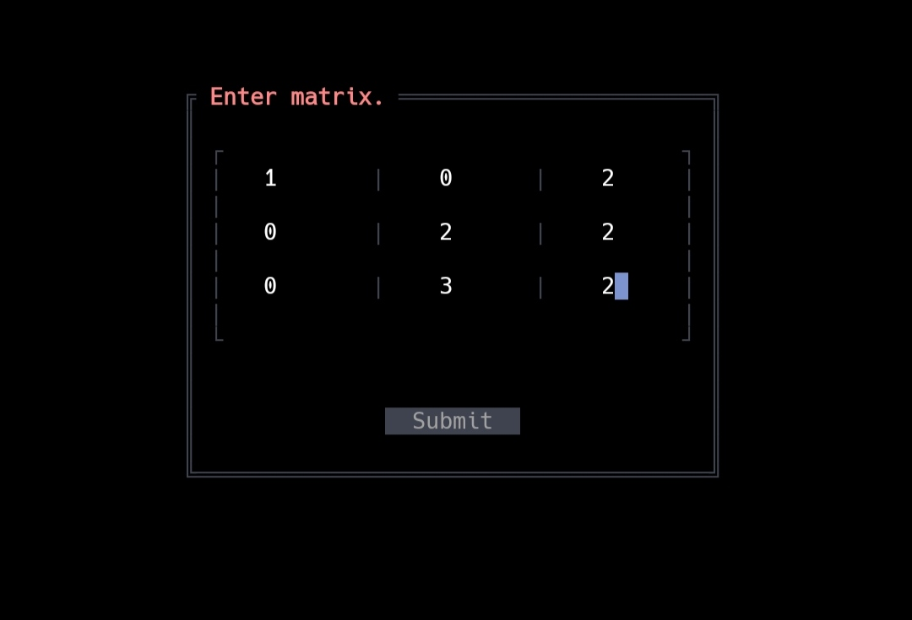
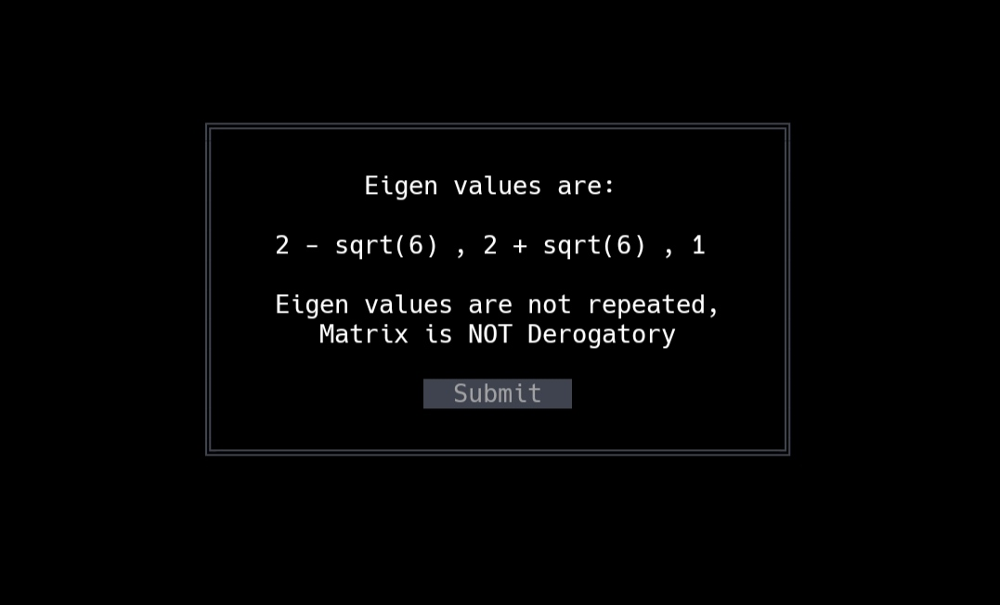

# EigenValuesTUI
This python program is used to calculate:
- Eigen Values
- Eigen Vectors
- Check if matrix is derogatory/non-derogatory

# Platforms 
This code is tested and working in Linux, Termux and WSL/Cygwin. Native windows consoles are not supported due to issues with pytermgui library. 

# Installation & Usage
1. Install git & python via terminal
   
2. Clone the repo/download and extract zip
```
git clone https://github.com/FrosT2k5/EigenValuesTUI
```

3. Change directory to EigenValuesTUI
```
cd EigenValuesTUI
```

4. Install requirements via pip
```
pip install -r requirements.txt
```

5. Run main.py
```
python main.py
```

6. Mouse OR up and down arrow keys can be used to select buttons and input fields

# Screenshots



# Libraries used 
- [sympy](https://sympy.org) - Used to calculate Eigen Values & Eigen Vectors
- [pytermgui](https://github.com/bczsalba/pytermgui) - Used for making Terminal UI
